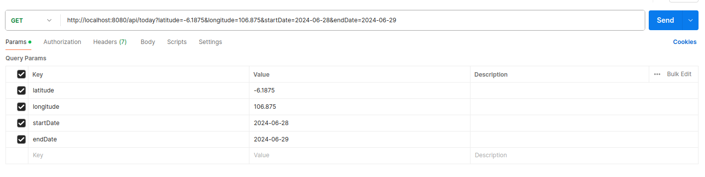
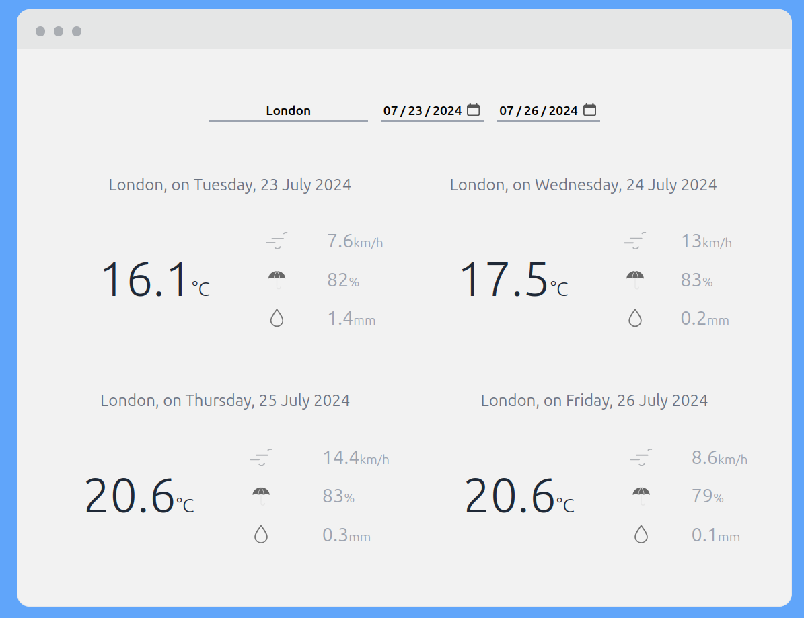
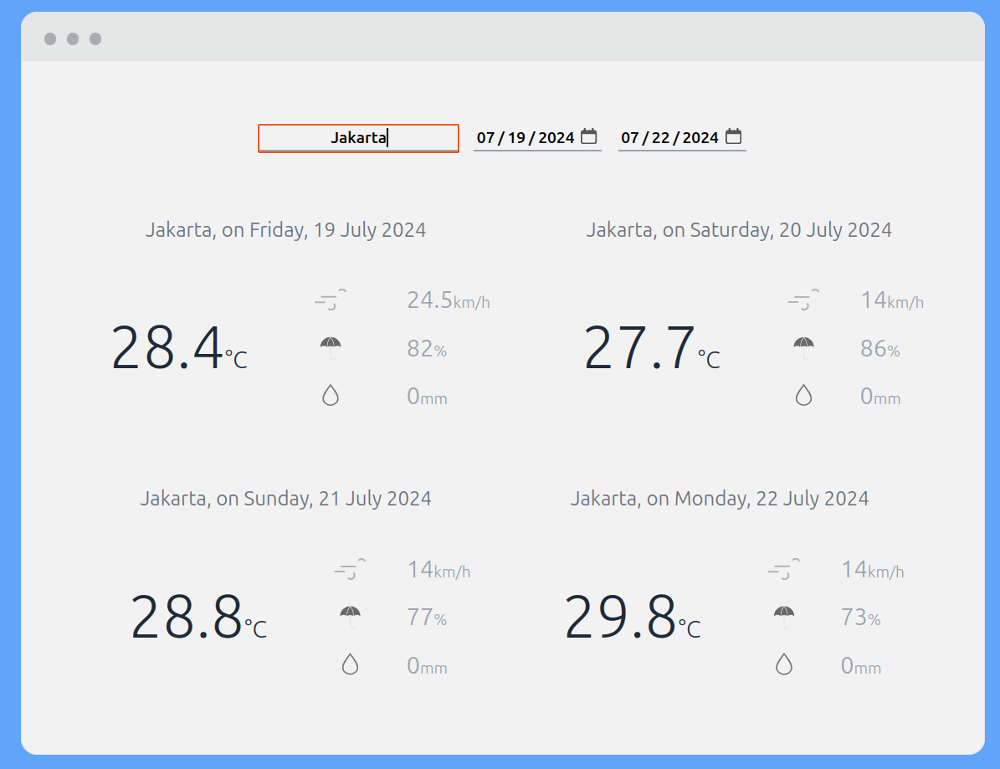

# Weather App with Java Spring Boot and Rest Client Implementation

## Contributor:
**[7. Hadiat Abdul Bashit](https://github.com/HadiatAbdulBashit)** \
**[13. Nurdiansyah](https://github.com/Nurdiansyah15)** \
**[14. Oki Nurul Abada](https://github.com/onuda22)** \
**[19. Virgo Fajar Pamungkas](https://github.com/virgojs)** 

## This app was build to get information about weather climate change, like:
### Weather Information, include
1. Latitude, describe the location information
2. Longitude, describe the location information
3. Generation Time in Milisecond
4. UTC off Set on Second
5. Timezone
6. Timezone Abbrevation
7. Daily Unit
8. Daily

### Daily unit have sort of information:
1. Time, time code in international standard (ISO)
2. Temperature, describe the temperature (in Celcius) in exact time
3. Wind Speed, describe the wind speed (in Km) on exact time
4. Relative Humidity, describe the humidity
5. Rain Sum, stand for Rain summary on selected date

### Daily is the array list data which contain all information about every item in Daily Unit.
### ------------------------------------------------------------------------------------------------
## Running BackEnd on Postman
### Get Data From Endpoint
This method can be see in class [WeatherServiceImpl](src/main/java/enigma/weather/service/implementation/WeatherServiceImpl.java)\
Input some information like **latitude and longitude** for describing place and input **time (StartDate and EndDate)**


### Output
```json lines
{
    "latitude": -6.1875,
    "longitude": 106.875,
    "generationtime_ms": 0.06592273712158203,
    "utc_offset_seconds": 0,
    "timezone": "GMT",
    "timezone_abbreviation": "GMT",
    "elevation": 10,
    "daily_units": {
        "time": "iso8601",
        "temperature_2m_mean": "°C",
        "wind_speed_10m_mean": "km/h",
        "relative_humidity_2m_mean": "%",
        "rain_sum": "mm"
    },
    "daily": {
        "time": [
            "2024-06-28",
            "2024-06-29"
        ],
        "temperature_2m_mean": [
            26.5,
            26.3
        ],
        "wind_speed_10m_mean": [
            16.9,
            11.9
        ],
        "relative_humidity_2m_mean": [
            70,
            73
        ],
        "rain_sum": [
            0.0,
            0.0
        ]
    }
}
```

### Get Data With User Interface (from Front-End)
Input Place and what time will go to be checked it's around startDate dan endDate.
The new data will be store to database.
But, the existing data will not be stored twice, and it will show on the app get
from database.

#### London on 07/23/2024 to 07/26/2024

### ----------------------------------------------------------
#### Jakarta on 07/19/2024 to 07/22/2024

